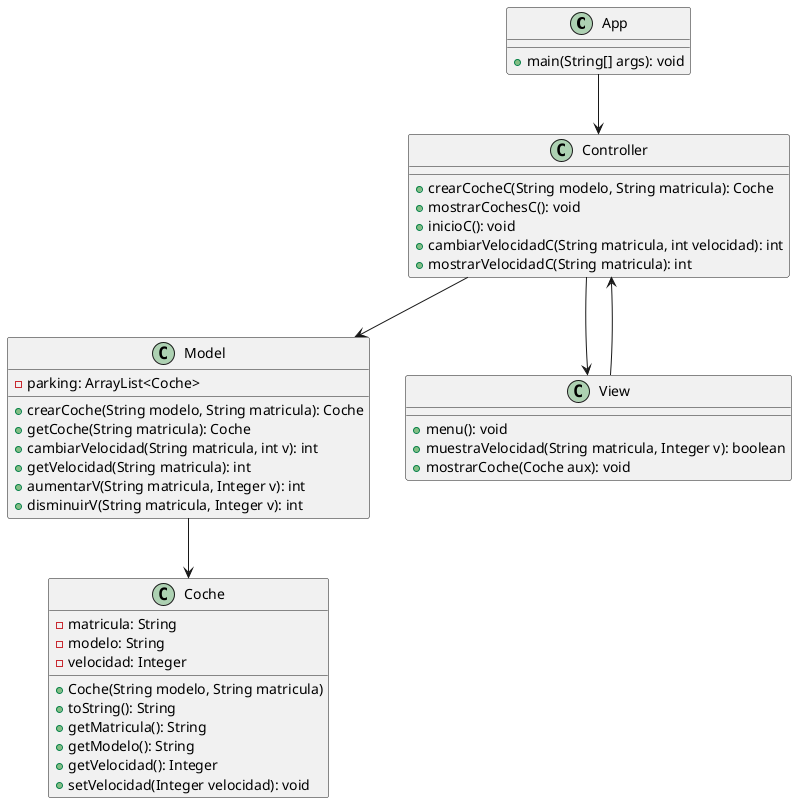
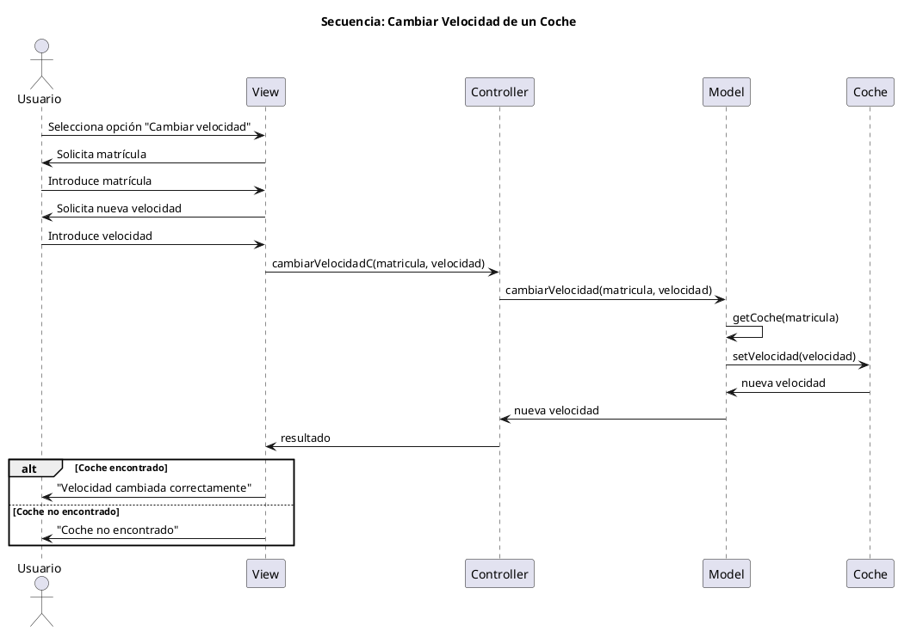
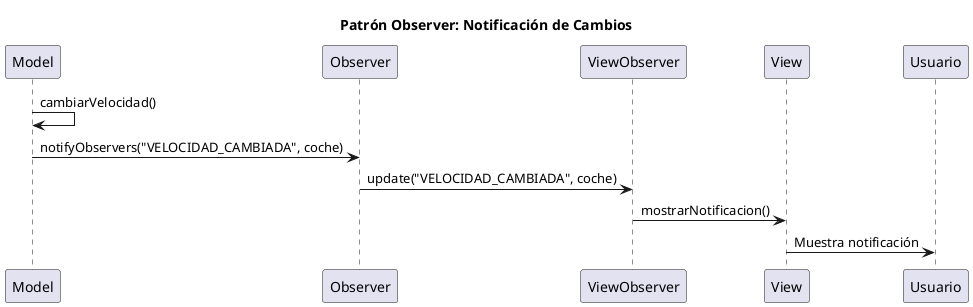

# Manual Completo: Desarrollo MVC con IntelliJ IDEA y GitHub

## Tabla de Contenidos
1. [Configuración Inicial del Proyecto](#configuración-inicial-del-proyecto)
2. [Sistema de Control de Versiones con Git](#sistema-de-control-de-versiones-con-git)
3. [Documentación con JavaDoc](#documentación-con-javadoc)
4. [Creación de README](#creación-de-readme)
5. [Diagramas UML](#diagramas-uml)
6. [Debugging en IntelliJ IDEA](#debugging-en-intellij-idea)
7. [Issues y Pull Requests en GitHub](#issues-y-pull-requests-en-github)
8. [Arquitectura MVC](#arquitectura-mvc)
9. [Patrón Observer](#patrón-observer)
10. [Implementación de Funcionalidades Avanzadas](#implementación-de-funcionalidades-avanzadas)
11. [Resolución de Errores Comunes](#resolución-de-errores-comunes)

---

## 1. Configuración Inicial del Proyecto

### 1.1 Creación del Proyecto en IntelliJ IDEA

1. **Abrir IntelliJ IDEA**
2. **New Project** → **Java** → **Next**
3. **Project name**: `ParkingMVC`
4. **Project location**: Elegir directorio
5. **Language**: Java
6. **Build system**: Maven o Gradle (recomendado Maven)
7. **JDK**: 11 o superior
8. **Create**

### 1.2 Estructura de Carpetas
```
ParkingMVC/
├── src/
│   └── main/
│       └── java/
│           ├── App.java
│           ├── model/
│           │   ├── Coche.java
│           │   └── Model.java
│           ├── view/
│           │   └── View.java
│           └── controller/
│               └── Controller.java
├── docs/
├── diagrams/
├── README.md
└── pom.xml (si usas Maven)
```

---

## 2. Sistema de Control de Versiones con Git

### 2.1 Inicialización desde IntelliJ IDEA

#### Método Visual (IntelliJ):
1. **VCS** → **Import into Version Control** → **Create Git Repository**
2. Seleccionar la carpeta del proyecto
3. **OK**

#### Método Terminal:
```bash
# Abrir terminal en IntelliJ (Alt + F12)
git init
git add .
git commit -m "Initial commit: MVC Car Parking System"
```

### 2.2 Configuración de GitHub

#### Desde IntelliJ:
1. **VCS** → **Git** → **Remotes**
2. **Add Remote**
3. **Name**: origin
4. **URL**: URL de tu repositorio GitHub

#### Desde Terminal:
```bash
git remote add origin https://github.com/tu-usuario/ParkingMVC.git
git branch -M main
git push -u origin main
```

### 2.3 Workflow de Commits

#### Desde IntelliJ:
1. **Ctrl + K** (Commit)
2. Seleccionar archivos
3. Escribir mensaje descriptivo
4. **Commit and Push**

#### Desde Terminal:
```bash
# Añadir archivos modificados
git add .

# Commit con mensaje descriptivo
git commit -m "feat: añadir funcionalidad de aumentar velocidad"

# Push al repositorio remoto
git push origin main
```

### 2.4 Convenciones de Commits
```
feat: nueva funcionalidad
fix: corrección de bug
docs: cambios en documentación
style: formato, espacios, etc.
refactor: refactorización de código
test: añadir o modificar tests
chore: tareas de mantenimiento
```

### 2.5 Manejo de Ramas
```bash
# Crear nueva rama
git checkout -b feature/nueva-funcionalidad

# Cambiar entre ramas
git checkout main
git checkout feature/nueva-funcionalidad

# Fusionar rama
git checkout main
git merge feature/nueva-funcionalidad

# Eliminar rama
git branch -d feature/nueva-funcionalidad
```

---

## 3. Documentación con JavaDoc

### 3.1 Configuración en IntelliJ

1. **File** → **Settings** → **Tools** → **JavaDoc**
2. **Javadoc tool path**: Configurar ruta del JDK
3. **Other command line arguments**: `-encoding UTF-8 -charset UTF-8`

### 3.2 Ejemplo de Documentación Mejorada

```java
/**
 * Clase modelo que representa un coche en el sistema de parking.
 * Implementa las operaciones básicas de un vehículo.
 * 
 * @author Tu Nombre
 * @version 1.0
 * @since 2024
 */
public class Coche {
    /**
     * Matrícula única del coche
     */
    private String matricula;
    
    /**
     * Modelo del coche
     */
    private String modelo;
    
    /**
     * Velocidad actual del coche en km/h
     */
    private Integer velocidad;
    
    /**
     * Constructor para crear un nuevo coche.
     * 
     * @param modelo El modelo del coche (no puede ser null)
     * @param matricula La matrícula del coche (debe ser única)
     * @throws IllegalArgumentException si los parámetros son inválidos
     */
    public Coche(String modelo, String matricula) {
        if (modelo == null || modelo.trim().isEmpty()) {
            throw new IllegalArgumentException("El modelo no puede estar vacío");
        }
        if (matricula == null || matricula.trim().isEmpty()) {
            throw new IllegalArgumentException("La matrícula no puede estar vacía");
        }
        
        this.modelo = modelo;
        this.matricula = matricula;
        this.velocidad = 0;
    }
    
    /**
     * Obtiene la matrícula del coche.
     * 
     * @return La matrícula del coche
     */
    public String getMatricula() {
        return matricula;
    }
    
    /**
     * Representa el coche como una cadena de texto.
     * 
     * @return Representación en String del coche
     */
    @Override
    public String toString() {
        return String.format("Coche{matricula='%s', modelo='%s', velocidad=%d}", 
                           matricula, modelo, velocidad);
    }
}
```

### 3.3 Generación de JavaDoc

#### Desde IntelliJ:
1. **Tools** → **Generate JavaDoc**
2. **Scope**: Whole project
3. **Output directory**: `docs/javadoc`
4. **OK**

#### Desde Terminal:
```bash
# Generar JavaDoc
javadoc -d docs/javadoc -sourcepath src/main/java -subpackages . -encoding UTF-8 -charset UTF-8
```

---

## 4. Creación de README

### 4.1 Estructura del README.md

```markdown
# Sistema de Parking MVC

## Descripción
Sistema de gestión de parking implementado con patrón MVC en Java.

## Características
- ✅ Gestión de coches (crear, mostrar, modificar velocidad)
- ✅ Arquitectura MVC
- ✅ Patrón Observer para notificaciones
- ✅ Interfaz de consola interactiva

## Instalación

### Prerrequisitos
- Java 11 o superior
- IntelliJ IDEA (recomendado)
- Git

### Pasos
1. Clonar el repositorio:
   ```bash
   git clone https://github.com/tu-usuario/ParkingMVC.git
   ```

2. Abrir en IntelliJ IDEA:
   - File → Open → Seleccionar carpeta del proyecto

3. Ejecutar:
   - Ejecutar la clase `App.java`

## Uso
```java
// Ejemplo de uso
public static void main(String[] args) {
    Controller.inicioC();
    View.menu();
}
```

## Arquitectura
- **Model**: Gestión de datos y lógica de negocio
- **View**: Interfaz de usuario (consola)
- **Controller**: Coordinador entre Model y View

## Contribuir
1. Fork del proyecto
2. Crear rama feature (`git checkout -b feature/nueva-funcionalidad`)
3. Commit cambios (`git commit -am 'Añadir nueva funcionalidad'`)
4. Push a la rama (`git push origin feature/nueva-funcionalidad`)
5. Crear Pull Request

## Licencia
MIT License

## Autor
Tu Nombre - [tu-email@ejemplo.com]
```

---

## 5. Diagramas UML

### 5.1 Diagrama de Clases

#### Usando PlantUML en IntelliJ:
1. **File** → **Settings** → **Plugins** → Buscar "PlantUML"
2. Instalar plugin
3. Crear archivo `class_diagram.puml`:



### 5.2 Diagrama de Secuencia



---

## 6. Debugging en IntelliJ IDEA

### 6.1 Configuración de Breakpoints

1. **Colocar breakpoint**: Click en el margen izquierdo del editor
2. **Tipos de breakpoints**:
   - **Line breakpoint**: Pausa en línea específica
   - **Method breakpoint**: Pausa al entrar/salir de método
   - **Exception breakpoint**: Pausa cuando ocurre excepción

### 6.2 Inicio del Debug

1. **Click derecho en App.java** → **Debug 'App.main()'**
2. O usar **Shift + F9**

### 6.3 Controles de Debug

- **F8**: Step Over (siguiente línea)
- **F7**: Step Into (entrar en método)
- **Shift + F8**: Step Out (salir de método)
- **F9**: Resume (continuar)
- **Ctrl + F8**: Toggle breakpoint

### 6.4 Ventanas de Debug

- **Variables**: Ver valores de variables
- **Watches**: Monitorear expresiones específicas
- **Call Stack**: Ver pila de llamadas
- **Console**: Salida del programa

### 6.5 Ejemplo de Debug Session

```java
public static int cambiarVelocidad(String matricula, int v) {
    Coche coche = getCoche(matricula); // Breakpoint aquí
    if (coche != null) {
        coche.velocidad = v; // Observar el cambio
        return coche.velocidad;
    }
    return -1;
}
```

---

## 7. Issues y Pull Requests en GitHub

### 7.1 Creación de Issues

#### Desde GitHub Web:
1. **Issues** → **New issue**
2. **Title**: Descripción concisa
3. **Comment**: Descripción detallada
4. **Labels**: bug, enhancement, documentation, etc.
5. **Assignees**: Asignar responsables
6. **Submit new issue**

#### Plantilla de Issue:
```markdown
## Descripción
Breve descripción del problema o mejora.

## Pasos para Reproducir
1. Paso 1
2. Paso 2
3. Paso 3

## Resultado Esperado
Lo que debería ocurrir.

## Resultado Actual
Lo que está ocurriendo.

## Información Adicional
- OS: Windows/Mac/Linux
- Java Version: 11
- IDE: IntelliJ IDEA 2024.1
```

### 7.2 Pull Requests

#### Proceso Completo:
1. **Crear rama para la funcionalidad**:
```bash
git checkout -b fix/velocidad-negativa
```

2. **Realizar cambios y commits**:
```bash
git add .
git commit -m "fix: prevenir velocidades negativas"
git push origin fix/velocidad-negativa
```

3. **Crear Pull Request en GitHub**:
   - **Compare & pull request**
   - **Title**: Descripción clara
   - **Comment**: Explicación detallada
   - **Reviewers**: Asignar revisores
   - **Create pull request**

#### Plantilla de Pull Request:
```markdown
## Descripción
Breve descripción de los cambios realizados.

## Tipo de Cambio
- [ ] Bug fix
- [ ] Nueva funcionalidad
- [ ] Cambio que rompe compatibilidad
- [ ] Documentación

## Testing
- [ ] Tests unitarios actualizados
- [ ] Pruebas manuales realizadas
- [ ] Todas las pruebas pasan

## Checklist
- [ ] Código sigue las convenciones del proyecto
- [ ] Auto-review realizado
- [ ] Comentarios añadidos en código complejo
- [ ] Documentación actualizada
```

---

## 8. Arquitectura MVC

### 8.1 Principios del MVC

- **Model**: Gestiona datos y lógica de negocio
- **View**: Presenta información al usuario
- **Controller**: Coordina Model y View

### 8.2 Mejoras al MVC Actual

#### 8.2.1 Refactorización del Model
```java
public class Model {
    private static final List<Coche> parking = new ArrayList<>();
    private static final List<Observer> observers = new ArrayList<>();
    
    /**
     * Añade un observador para notificaciones
     */
    public static void addObserver(Observer observer) {
        observers.add(observer);
    }
    
    /**
     * Notifica a todos los observadores
     */
    private static void notifyObservers(String evento, Coche coche) {
        for (Observer observer : observers) {
            observer.update(evento, coche);
        }
    }
    
    public static Coche crearCoche(String modelo, String matricula) {
        validateInput(modelo, matricula);
        
        if (existeCoche(matricula)) {
            throw new IllegalArgumentException("Ya existe un coche con esa matrícula");
        }
        
        Coche coche = new Coche(modelo, matricula);
        parking.add(coche);
        notifyObservers("COCHE_CREADO", coche);
        return coche;
    }
    
    private static void validateInput(String modelo, String matricula) {
        if (modelo == null || modelo.trim().isEmpty()) {
            throw new IllegalArgumentException("El modelo no puede estar vacío");
        }
        if (matricula == null || matricula.trim().isEmpty()) {
            throw new IllegalArgumentException("La matrícula no puede estar vacía");
        }
    }
    
    private static boolean existeCoche(String matricula) {
        return parking.stream()
                     .anyMatch(coche -> coche.getMatricula().equals(matricula));
    }
}
```

#### 8.2.2 Mejora del Controller
```java
public class Controller {
    static {
        // Registrar View como observador
        Model.addObserver(new ViewObserver());
    }
    
    public static boolean avanzarCoche(String matricula, int incremento) {
        try {
            if (incremento <= 0) {
                throw new IllegalArgumentException("El incremento debe ser positivo");
            }
            
            int nuevaVelocidad = Model.aumentarV(matricula, incremento);
            if (nuevaVelocidad == -1) {
                View.mostrarError("Coche no encontrado: " + matricula);
                return false;
            }
            
            View.mostrarMensaje("Coche acelerado. Nueva velocidad: " + nuevaVelocidad + " km/h");
            return true;
            
        } catch (Exception e) {
            View.mostrarError("Error al avanzar: " + e.getMessage());
            return false;
        }
    }
    
    public static boolean ponerGasolina(String matricula, int litros) {
        try {
            if (litros <= 0) {
                throw new IllegalArgumentException("Los litros deben ser positivos");
            }
            
            Coche coche = Model.getCoche(matricula);
            if (coche == null) {
                View.mostrarError("Coche no encontrado: " + matricula);
                return false;
            }
            
            // Simular repostaje (resetear velocidad como si fuera un reinicio)
            Model.cambiarVelocidad(matricula, 0);
            View.mostrarMensaje("Repostaje completado para " + matricula + 
                              ". " + litros + " litros añadidos.");
            return true;
            
        } catch (Exception e) {
            View.mostrarError("Error al repostar: " + e.getMessage());
            return false;
        }
    }
}
```

---

## 9. Patrón Observer

### 9.1 Implementación del Observer

#### 9.1.1 Interface Observer
```java
public interface Observer {
    void update(String evento, Coche coche);
}
```

#### 9.1.2 ViewObserver
```java
public class ViewObserver implements Observer {
    @Override
    public void update(String evento, Coche coche) {
        switch (evento) {
            case "COCHE_CREADO":
                System.out.println("🚗 Nuevo coche añadido al parking: " + coche.getMatricula());
                break;
            case "VELOCIDAD_CAMBIADA":
                System.out.println("⚡ Velocidad actualizada para " + coche.getMatricula() + 
                                 ": " + coche.getVelocidad() + " km/h");
                break;
            case "COCHE_ELIMINADO":
                System.out.println("❌ Coche eliminado del parking: " + coche.getMatricula());
                break;
        }
    }
}
```

### 9.2 Diagrama de Secuencia del Observer



---

## 10. Implementación de Funcionalidades Avanzadas

### 10.1 Pseudocódigo: Función Avanzar

```
FUNCIÓN avanzarCoche(matricula: String, incremento: Integer) -> Boolean
INICIO
    SI incremento <= 0 ENTONCES
        MOSTRAR "Error: El incremento debe ser positivo"
        RETORNAR false
    FIN SI
    
    coche = BUSCAR_COCHE(matricula)
    SI coche == null ENTONCES
        MOSTRAR "Error: Coche no encontrado"
        RETORNAR false
    FIN SI
    
    velocidadAnterior = coche.velocidad
    coche.velocidad = coche.velocidad + incremento
    
    SI coche.velocidad > VELOCIDAD_MAXIMA ENTONCES
        coche.velocidad = VELOCIDAD_MAXIMA
        MOSTRAR "Advertencia: Velocidad limitada a máxima permitida"
    FIN SI
    
    NOTIFICAR_OBSERVADORES("VELOCIDAD_CAMBIADA", coche)
    MOSTRAR "Coche acelerado de " + velocidadAnterior + " a " + coche.velocidad + " km/h"
    RETORNAR true
FIN
```

### 10.2 Implementación: Función Avanzar

```java
/**
 * Aumenta la velocidad de un coche de forma segura.
 * 
 * @param matricula Matrícula del coche
 * @param incremento Incremento de velocidad (debe ser positivo)
 * @return true si la operación fue exitosa, false en caso contrario
 */
public static boolean avanzarCoche(String matricula, int incremento) {
    // Validación de entrada
    if (incremento <= 0) {
        View.mostrarError("El incremento de velocidad debe ser positivo");
        return false;
    }
    
    try {
        Coche coche = Model.getCoche(matricula);
        if (coche == null) {
            View.mostrarError("No se encontró el coche con matrícula: " + matricula);
            return false;
        }
        
        int velocidadAnterior = coche.getVelocidad();
        int nuevaVelocidad = velocidadAnterior + incremento;
        
        // Límite de velocidad máxima
        final int VELOCIDAD_MAXIMA = 120;
        if (nuevaVelocidad > VELOCIDAD_MAXIMA) {
            nuevaVelocidad = VELOCIDAD_MAXIMA;
            View.mostrarAdvertencia("Velocidad limitada a " + VELOCIDAD_MAXIMA + " km/h");
        }
        
        // Actualizar velocidad
        Model.cambiarVelocidad(matricula, nuevaVelocidad);
        
        // Mostrar resultado
        View.mostrarMensaje(String.format(
            "🚗 Coche %s acelerado: %d km/h → %d km/h (+%d km/h)",
            matricula, velocidadAnterior, nuevaVelocidad, incremento
        ));
        
        return true;
        
    } catch (Exception e) {
        View.mostrarError("Error inesperado al avanzar el coche: " + e.getMessage());
        return false;
    }
}
```

### 10.3 Pseudocódigo: Función Poner Gasolina

```
FUNCIÓN ponerGasolina(matricula: String, litros: Integer) -> Boolean
INICIO
    SI litros <= 0 ENTONCES
        MOSTRAR "Error: Los litros deben ser positivos"
        RETORNAR false
    FIN SI
    
    coche = BUSCAR_COCHE(matricula)
    SI coche == null ENTONCES
        MOSTRAR "Error: Coche no encontrado"
        RETORNAR false
    FIN SI
    
    // Simular proceso de repostaje
    MOSTRAR "Iniciando repostaje..."
    ESPERAR(2000) // Simular tiempo de repostaje
    
    // Resetear velocidad (como si fuera un reinicio tras repostaje)
    velocidadAnterior = coche.velocidad
    coche.velocidad = 0
    
    costoTotal = litros * PRECIO_POR_LITRO
    
    NOTIFICAR_OBSERVADORES("GASOLINA_AÑADIDA", coche)
    MOSTRAR "Repostaje completado:"
    MOSTRAR "- Litros: " + litros
    MOSTRAR "- Costo: " + costoTotal + "€"
    MOSTRAR "- Velocidad reiniciada a 0 km/h"
    
    RETORNAR true
FIN
```

### 10.4 Implementación: Función Poner Gasolina

```java
/**
 * Simula el proceso de repostaje de un coche.
 * 
 * @param matricula Matrícula del coche
 * @param litros Cantidad de litros a añadir
 * @return true si el repostaje fue exitoso, false en caso contrario
 */
public static boolean ponerGasolina(String matricula, int litros) {
    // Validación de entrada
    if (litros <= 0) {
        View.mostrarError("La cantidad de litros debe ser positiva");
        return false;
    }
    
    if (litros > 100) {
        View.mostrarError("No se pueden añadir más de 100 litros");
        return false;
    }
    
    try {
        Coche coche = Model.getCoche(matricula);
        if (coche == null) {
            View.mostrarError("No se encontró el coche con matrícula: " + matricula);
            return false;
        }
        
        // Simular proceso de repostaje
        View.mostrarMensaje("⛽ Iniciando repostaje para " + matricula + "...");
        
        // Simular tiempo de espera
        try {
            Thread.sleep(1000); // 1 segundo de simulación
        } catch (InterruptedException e) {
            Thread.currentThread().interrupt();
        }
        
        // Cálculos
        final double PRECIO_POR_LITRO = 1.45; // €/litro
        double costoTotal = litros * PRECIO_POR_LITRO;
        int velocidadAnterior = coche.getVelocidad();
        
        // Resetear velocidad (simula que el coche se detiene para repostar)
        Model.cambiarVelocidad(matricula, 0);
        
        // Mostrar resumen
        View.mostrarMensaje("✅ Repostaje completado:");
        View.mostrarMensaje("   📊 Vehículo: " + matricula);
        View.mostrarMensaje("   ⛽ Litros añadidos: " + litros + "L");
        View.mostrarMensaje("   💰 Costo total: " + String.format("%.2f€", costoTotal));
        View.mostrarMensaje("   🚗 Velocidad: " + velocidadAnterior + " → 0 km/h (vehículo detenido)");
        
        return true;
        
    } catch (Exception e) {
        View.mostrarError("Error durante el repostaje: " + e.getMessage());
        return false;
    }
}
```

### 10.5 Actualización del Menú

```java
public static void menu() {
    Scanner teclado = new Scanner(System.in);
    int opcion;
    
    do {
        System.out.println("\n" + "=".repeat(40));
        System.out.println("🚗 SISTEMA DE GESTIÓN DE PARKING");
        System.out.println("=".repeat(40));
        System.out.println("0. 📋 Mostrar coches");
        System.out.println("1. ➕ Crear coche");
        System.out.println("2. ⚡ Cambiar velocidad");
        System.out.println("3. 📊 Mostrar velocidad");
        System.out.println("4. 🚀 Avanzar coche");
        System.out.println("5. ⛽ Poner gasolina");
        System.out.println("6. ❌ Salir");
        System.out.println("=".repeat(40));
        System.out.print("Elige una opción: ");

        opcion = teclado.nextInt();
        teclado.nextLine(); // Consumir salto de línea

        switch (opcion) {
            case 4:
                System.out.print("Introduce la matrícula: ");
                String matricula = teclado.nextLine();
                System.out.print("Introduce el incremento de velocidad: ");
                int incremento = teclado.nextInt();
                Controller.avanzarCoche(matricula, incremento);
                break;
                
            case 5:
                System.out.print("Introduce la matrícula: ");
                matricula = teclado.nextLine();
                System.out.print("Introduce los litros de gasolina: ");
                int litros = teclado.nextInt();
                Controller.ponerGasolina(matricula, litros);
                break;
                
            case 6:
                System.out.println("👋 ¡Hasta luego!");
                break;
                
            default:
                System.out.println("❌ Opción no válida.");
        }
    } while (opcion != 6);
}
```

---

## 11. Resolución de Errores Comunes

### 11.1 Errores de Compilación

#### Error: "Cannot resolve symbol"
**Causa**: Importaciones faltantes o clases no encontradas.
**Solución**:
```java
// Añadir importaciones necesarias
import java.util.ArrayList;
import java.util.List;
import java.util.Scanner;
```

#### Error: "Non-static method cannot be referenced from static context"
**Causa**: Intentar llamar método no estático desde contexto estático.
**Solución**:
```java
// ❌ Incorrecto
public class Controller {
    public void metodoNoEstatico() { }
    
    public static void main(String[] args) {
        metodoNoEstatico(); // Error
    }
}

// ✅ Correcto - Opción 1: Hacer método estático
public class Controller {
    public static void metodoEstatico() { }
    
    public static void main(String[] args) {
        metodoEstatico(); // OK
    }
}

// ✅ Correcto - Opción 2: Crear instancia
public class Controller {
    public void metodoNoEstatico() { }
    
    public static void main(String[] args) {
        Controller controller = new Controller();
        controller.metodoNoEstatico(); // OK
    }
}
```

### 11.2 Errores de Ejecución

#### NullPointerException
**Causa**: Acceso a objeto null.
**Solución**:
```java
// ❌ Problema
public static Coche getCoche(String matricula) {
    // Si no encuentra el coche retorna null
    return null;
}

public static void mostrarCoche(String matricula) {
    Coche coche = getCoche(matricula);
    System.out.println(coche.toString()); // NullPointerException
}

// ✅ Solución
public static void mostrarCoche(String matricula) {
    Coche coche = getCoche(matricula);
    if (coche != null) {
        System.out.println(coche.toString());
    } else {
        System.out.println("Coche no encontrado: " + matricula);
    }
}
```

#### InputMismatchException
**Causa**: Tipo de dato incorrecto en Scanner.
**Solución**:
```java
// ❌ Problema
Scanner scanner = new Scanner(System.in);
int numero = scanner.nextInt(); // Error si usuario ingresa texto

// ✅ Solución
Scanner scanner = new Scanner(System.in);
try {
    int numero = scanner.nextInt();
    // Procesar número
} catch (InputMismatchException e) {
    System.out.println("Error: Debe ingresar un número válido");
    scanner.nextLine(); // Limpiar buffer
}
```

### 11.3 Errores de Git

#### Error: "fatal: not a git repository"
**Causa**: No está en un repositorio Git.
**Solución**:
```bash
# Verificar si está en repositorio Git
git status

# Si no es repositorio, inicializar
git init

# O clonar repositorio existente
git clone https://github.com/usuario/repo.git
```

#### Error: "Your branch is behind"
**Causa**: Rama local desactualizada.
**Solución**:
```bash
# Actualizar rama local
git pull origin main

# O forzar actualización (cuidado: puede perder cambios)
git fetch origin
git reset --hard origin/main
```

#### Error: "Merge conflict"
**Causa**: Conflictos al fusionar ramas.
**Solución**:
```bash
# 1. Ver archivos en conflicto
git status

# 2. Editar archivos conflictivos
# Buscar marcadores: <<<<<<< HEAD, =======, >>>>>>> branch

# 3. Resolver conflictos manualmente
# Eliminar marcadores y mantener código deseado

# 4. Marcar como resuelto
git add archivo-resuelto.java

# 5. Completar merge
git commit -m "Resolve merge conflict"
```

### 11.4 Errores de GitHub

#### Error: "Permission denied (publickey)"
**Causa**: Problemas de autenticación SSH.
**Solución**:
```bash
# Usar HTTPS en lugar de SSH
git remote set-url origin https://github.com/usuario/repo.git

# O configurar SSH key
ssh-keygen -t rsa -b 4096 -C "tu-email@ejemplo.com"
# Añadir key pública a GitHub Settings > SSH Keys
```

#### Error: "Remote repository not found"
**Causa**: URL incorrecta o repositorio no existe.
**Solución**:
```bash
# Verificar URL remota
git remote -v

# Corregir URL
git remote set-url origin https://github.com/usuario/repo-correcto.git
```

### 11.5 Errores de IntelliJ IDEA

#### Error: "Project SDK is not defined"
**Causa**: JDK no configurado.
**Solución**:
1. **File** → **Project Structure** → **Project**
2. **Project SDK**: Seleccionar JDK instalado
3. **Project language level**: Elegir versión apropiada
4. **Apply** → **OK**

#### Error: "Cannot resolve symbol java.lang"
**Causa**: Configuración de proyecto corrupta.
**Solución**:
1. **File** → **Invalidate Caches and Restart**
2. **Invalidate and Restart**
3. Esperar reindexación completa

### 11.6 Mejores Prácticas para Evitar Errores

#### 11.6.1 Validación de Entrada
```java
public static boolean validarMatricula(String matricula) {
    if (matricula == null || matricula.trim().isEmpty()) {
        System.out.println("Error: La matrícula no puede estar vacía");
        return false;
    }
    
    if (matricula.length() < 4 || matricula.length() > 10) {
        System.out.println("Error: La matrícula debe tener entre 4 y 10 caracteres");
        return false;
    }
    
    if (!matricula.matches("^[A-Za-z0-9]+$")) {
        System.out.println("Error: La matrícula solo puede contener letras y números");
        return false;
    }
    
    return true;
}
```

#### 11.6.2 Manejo de Excepciones
```java
public class ParkingException extends Exception {
    public ParkingException(String mensaje) {
        super(mensaje);
    }
}

public static Coche crearCoche(String modelo, String matricula) throws ParkingException {
    if (!validarModelo(modelo)) {
        throw new ParkingException("Modelo inválido: " + modelo);
    }
    
    if (!validarMatricula(matricula)) {
        throw new ParkingException("Matrícula inválida: " + matricula);
    }
    
    if (existeCoche(matricula)) {
        throw new ParkingException("Ya existe un coche con matrícula: " + matricula);
    }
    
    try {
        Coche coche = new Coche(modelo, matricula);
        parking.add(coche);
        return coche;
    } catch (Exception e) {
        throw new ParkingException("Error al crear coche: " + e.getMessage());
    }
}
```

#### 11.6.3 Testing Unitario
```java
import org.junit.jupiter.api.Test;
import org.junit.jupiter.api.BeforeEach;
import static org.junit.jupiter.api.Assertions.*;

public class ModelTest {
    
    @BeforeEach
    void setUp() {
        // Limpiar parking antes de cada test
        Model.parking.clear();
    }
    
    @Test
    void testCrearCoche() {
        Coche coche = Model.crearCoche("Toyota", "ABC123");
        
        assertNotNull(coche);
        assertEquals("Toyota", coche.getModelo());
        assertEquals("ABC123", coche.getMatricula());
        assertEquals(0, coche.getVelocidad());
    }
    
    @Test
    void testCocheYaExiste() {
        Model.crearCoche("Toyota", "ABC123");
        
        assertThrows(ParkingException.class, () -> {
            Model.crearCoche("Honda", "ABC123");
        });
    }
    
    @Test
    void testCambiarVelocidad() {
        Model.crearCoche("Toyota", "ABC123");
        int nuevaVelocidad = Model.cambiarVelocidad("ABC123", 50);
        
        assertEquals(50, nuevaVelocidad);
    }
    
    @Test
    void testCocheNoEncontrado() {
        int resultado = Model.cambiarVelocidad("NOEXISTE", 50);
        assertEquals(-1, resultado);
    }
}
```

---

## 12. Comandos de Referencia Rápida

### 12.1 Git Commands
```bash
# Configuración inicial
git config --global user.name "Tu Nombre"
git config --global user.email "tu-email@ejemplo.com"

# Operaciones básicas
git init                          # Inicializar repositorio
git clone <url>                   # Clonar repositorio
git add .                         # Añadir todos los archivos
git add <archivo>                 # Añadir archivo específico
git commit -m "mensaje"           # Commit con mensaje
git push origin main              # Subir cambios
git pull origin main              # Descargar cambios
git status                        # Ver estado
git log                          # Ver historial

# Ramas
git branch                        # Ver ramas
git branch <nombre>               # Crear rama
git checkout <rama>               # Cambiar rama
git checkout -b <rama>            # Crear y cambiar rama
git merge <rama>                  # Fusionar rama
git branch -d <rama>              # Eliminar rama

# Deshacer cambios
git checkout -- <archivo>        # Descartar cambios en archivo
git reset HEAD <archivo>          # Quitar del staging
git revert <commit>               # Revertir commit
git reset --hard <commit>         # Volver a commit específico
```

### 12.2 IntelliJ IDEA Shortcuts
```
# Navegación
Ctrl + N                          # Buscar clase
Ctrl + Shift + N                  # Buscar archivo
Ctrl + E                          # Archivos recientes
Ctrl + B                          # Ir a declaración
Alt + F7                          # Buscar usos

# Edición
Ctrl + D                          # Duplicar línea
Ctrl + Y                          # Eliminar línea
Ctrl + /                          # Comentar línea
Ctrl + Shift + /                  # Comentar bloque
Alt + Insert                      # Generar código

# Refactoring
Shift + F6                        # Renombrar
Ctrl + Alt + M                    # Extraer método
Ctrl + Alt + V                    # Extraer variable
Ctrl + Alt + L                    # Formatear código

# Debug
Ctrl + F8                         # Toggle breakpoint
F9                                # Resume
F8                                # Step over
F7                                # Step into
Shift + F8                        # Step out

# Ejecución
Shift + F10                       # Run
Shift + F9                        # Debug
Ctrl + Shift + F10                # Run context
```

### 12.3 Maven Commands
```bash
# Compilar proyecto
mvn compile

# Ejecutar tests
mvn test

# Generar JAR
mvn package

# Limpiar proyecto
mvn clean

# Instalar en repositorio local
mvn install

# Generar documentación
mvn javadoc:javadoc

# Ejecutar aplicación
mvn exec:java -Dexec.mainClass="App"
```

---

## 13. Recursos Adicionales

### 13.1 Documentación Oficial
- [Java Documentation](https://docs.oracle.com/en/java/)
- [IntelliJ IDEA Help](https://www.jetbrains.com/help/idea/)
- [Git Documentation](https://git-scm.com/doc)
- [GitHub Docs](https://docs.github.com/)

### 13.2 Herramientas Recomendadas
- **PlantUML**: Para diagramas UML
- **SonarLint**: Análisis de código
- **CheckStyle**: Estilo de código
- **JUnit 5**: Testing unitario
- **Mockito**: Mocking para tests

### 13.3 Extensiones IntelliJ
- **PlantUML Integration**
- **SonarLint**
- **CheckStyle-IDEA**
- **GitToolBox**
- **Rainbow Brackets**

---

## 14. Conclusión

Este manual proporciona una guía completa para el desarrollo del sistema de parking MVC con todas las herramientas y prácticas necesarias. Recuerda:

1. **Seguir buenas prácticas** de programación y documentación
2. **Usar control de versiones** apropiadamente
3. **Escribir código limpio** y mantenible
4. **Documentar adecuadamente** con JavaDoc
5. **Probar exhaustivamente** el código
6. **Resolver errores sistemáticamente**
